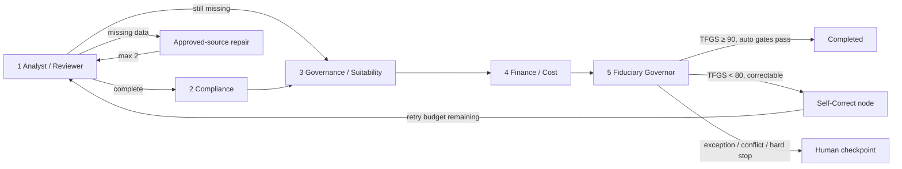

# Fiducia

**Five bounded agents. One evidence chain. Accountable decisions.**

Fiducia is a runnable, synthetic prototype for the 2026 ASU / TIAA AI Investment Spark Challenge. It turns a mutual-fund or ETF nomination into an evidence-backed due-diligence packet, deterministic control results, a fee comparison, a plan-fit assessment, and a governed approval recommendation.

The key design choice is simple: **the model may extract and explain; it may not invent a number, change a rule, execute an override, or approve its own exception.**

> This is an educational hackathon prototype using synthetic data and illustrative internal policy. It is not legal, fiduciary, tax, or investment advice and does not model or claim to represent TIAA's internal process.

## Demo in two minutes

```bash
python3 -m venv .venv
.venv/bin/pip install -r requirements-dev.txt
.venv/bin/streamlit run app.py
```

Open the URL printed by Streamlit, then run these scenarios:

Keep **Lock seeded identity** enabled for the rehearsed routes. Use **Restore
scenario defaults** before a live run if a field was edited. In particular,
`DATA` must remain `US Equity Index`; changing an identity field intentionally
blocks catalog enrichment and demonstrates the fail-closed route.

| Scenario | What it proves | Route | TFGS |
|---|---|---|---|
| `SUNX` | Complete, low-cost golden path | `APPROVE` — no human touch | 100 |
| `DATA` | Missing Sharpe ratio | Approved-source enrichment, retry `1/2`, then `APPROVE_WITH_CONDITIONS` | 100 |
| `ALPHX` | Expense ratio over internal category cap | `ESCALATE` to human | 100 |
| `SPECX` | Status, suitability and cost hard stops | `REJECT` — no autonomous execution | 90 |
| `CONFX` | Conflicting source evidence | `ESCALATE` — fail closed to human | 65 |
| `INJX` | Prompt-injection text inside evidence | `ESCALATE` — content isolated, scanner `BLOCKED` | 85 |
| `BLANK` | Fee absent from every approved source | `ESCALATE` — blank remains missing after `2/2` | 70 |

For a terminal smoke demo:

```bash
.venv/bin/python scripts/run_demo.py --scenario all
```

## Five-agent graph



LangGraph owns state and conditional routing. Amazon Bedrock Converse is an optional narrative layer. Deterministic Python owns validation, math, policy outcomes, risk scoring and human-intervention gates. The same graph has an Amazon Bedrock AgentCore entrypoint in [`agentcore_app.py`](agentcore_app.py).

## TIAA Fiduciary Guardrail Score (TFGS) and Self-Correcting Loop

The **Fiduciary Governor** (node `decision_owner`) computes a TFGS (0–100) before issuing any recommendation. TFGS starts at 100 and applies four deterministic deductions:

| Condition | Deduction | Source agent |
|---|---|---|
| Any required field still missing after analysis | −15 | analyst |
| Deterministic risk score > 35 | −10 | compliance |
| Expense ratio within 10 bps of category cap | −10 | finance |
| Any specialist confidence < 0.90 | −15 | lowest-confidence agent |

**Routing thresholds** (from `config/policy_rules.json` `fiduciary_guardrail`):

- TFGS ≥ 90 → auto-approve path if all other gates pass
- TFGS < 90 → at minimum `APPROVE_WITH_CONDITIONS` or `ESCALATE`
- TFGS < 80 → mandatory human review (`needs_human = True`)

**Self-correcting loop**: when TFGS < 80 and the deficit is correctable (missing field that the catalog can fill), the Governor emits `SELF_CORRECT` and the graph routes back to the analyst. This is bounded by `max_retries` (default 2) and is **blocked** by conflicts, hard stops, analyst FAIL outcome, or retry exhaustion — so CONFX, INJX, and SPECX scenarios never enter the loop.

Every Governor decision writes an **immutable `fiduciary_guardrail_receipt`** to state: TFGS score, itemized deductions, policy version/hash, decision, UTC timestamp, and a SHA-256 integrity hash. The receipt is also written to the JSONL audit trace and displayed in the Streamlit audit tab.

AWS now describes Bedrock Agents as **Agents Classic** and directs new applications toward AgentCore. Fiducia therefore uses Bedrock Runtime/Converse plus an AgentCore-compatible adapter instead of creating a new Classic dependency. See the [official Agents Classic maintenance notice](https://docs.aws.amazon.com/bedrock/latest/userguide/agents-classic-maintenance-mode.html) and [AgentCore Runtime documentation](https://docs.aws.amazon.com/bedrock-agentcore/latest/devguide/agents-tools-runtime.html).

## Why this is not “five chatbots”

- A typed case state moves through explicit conditional edges.
- Each specialist has one role, a version-controlled prompt and a declared fixed tool set.
- Numeric checks and fee projections are deterministic and reproducible.
- Missing data triggers at most two materially bounded catalog lookups.
- Source conflicts, injection signals and boundary conditions cannot be voted away.
- The sponsor agent aggregates findings but cannot overwrite them.
- Human overrides require a reviewer ID, rationale and attestation; `REJECT → APPROVE` also requires a distinct second ID. Production still requires authenticated SSO/RBAC.
- Every transition is written to an append-only, SHA-256 hash-chained JSONL trace.

The local audit is accurately described as **tamper-evident**. Production hardens it to immutable/WORM storage using S3 Object Lock (Compliance mode), KMS and CloudTrail.

## Exact human gates

A case pauses for a named human when any of the following is true:

- recommendation is not plain `APPROVE`;
- minimum specialist confidence is below `0.85`;
- auto-approval confidence is below `0.90`;
- deterministic risk is at least `40/100` (mandatory review);
- expense ratio is within `±5 bps` of its category cap;
- any required field remains missing after two approved-source retries;
- sources conflict, an injection pattern is detected, or a hard-stop control fires;
- a `REJECT → APPROVE` override is attempted (the prototype requires a distinct second free-text ID; authenticated maker-checker is a production gate).

All values live in [`config/policy_rules.json`](config/policy_rules.json), with version, owner, scope, effective date and a runtime SHA-256 hash.

## Data model

The synthetic catalog includes the challenge metrics:

- NAV;
- expense ratio;
- Sharpe ratio;
- total 12b-1 fee plus distribution/service components;
- turnover rate.

It also carries explicit front-end sales-load evidence, AUM, track record, plan-risk score, status, as-of date, source-conflict flag and an untrusted evidence note. Empty and zero are different values. See [`data/mock_funds.csv`](data/mock_funds.csv).

## Bedrock modes

Offline mode is the default and is presentation-safe. It uses evidence-grounded templates while running the complete graph, tools, policies, retries, audit and HITL logic.

To enable Bedrock explanations:

```bash
export AWS_REGION=us-east-1
export BEDROCK_MODEL_ID=us.anthropic.claude-sonnet-5
.venv/bin/streamlit run app.py
```

The process reads environment variables directly; it does not automatically load a `.env` file.

Choose **Amazon Bedrock Converse** in the sidebar. If inference or credentials fail, the narrative layer safely falls back; the deterministic decision is unchanged. Optional `BEDROCK_GUARDRAIL_ID` and `BEDROCK_GUARDRAIL_VERSION` values apply a configured Bedrock Guardrail.

[`agentcore_app.py`](agentcore_app.py) is an AgentCore SDK-compatible entrypoint. Deployment still requires creating a current AgentCore CLI project/configuration in the hackathon account, mapping the approved IAM role, and validating `agentcore dev` before any dry run or deployment. That account-specific step was not executed locally; see the validation report. Do not deploy from a personal account without cost and IAM review.

The local adapter contract can be reproduced without AWS credentials:

```bash
.venv/bin/pip install -r requirements-aws.txt
.venv/bin/python scripts/smoke_agentcore.py
```

It checks an invalid request returns HTTP `422` and a valid offline SUNX request returns HTTP `200`/`APPROVE`; it does not call Bedrock or deploy anything.

## Test and verify

```bash
.venv/bin/pytest
```

The automated suite covers:

- golden-path auto-approval;
- missing-data recovery and retry exhaustion;
- injection containment;
- hard-stop behavior;
- two-person overrides;
- blank-versus-zero semantics;
- reproducible fee math;
- audit-chain integrity and tamper detection;
- strict API/ingress typing, including boolean-as-number attacks;
- malformed plan profiles, absent load evidence and non-string identities;
- regulatory-reference labeling that makes no legal-compliance determination;
- TFGS score calculation (each deduction rule in isolation and stacked);
- Fiduciary Governor self-correct routing, retry exhaustion, conflict and hard-stop guards;
- all 7 demo scenarios locked to their documented routes — no scenario may end as SELF_CORRECT;
- TFGS values for every scenario within expected ranges.

## Repository map

```text
app.py                         Streamlit decision cockpit
agentcore_app.py               Bedrock AgentCore runtime adapter
fiducia/
  agents.py                    Five specialists + Fiduciary Governor + calculate_tfgs_score()
  workflow.py                  LangGraph, conditional edges, retry and HITL nodes
  policy.py                    Deterministic policy and fee math
  prompts.py                   Explicit prompts and allowlisted tools
  llm.py                       Optional Bedrock Converse narrative adapter
  audit.py                     JSONL hash-chain writer/verifier
  validation.py                Strict external request and fail-closed ingress checks
config/policy_rules.json       Versioned illustrative policy pack
data/                          Synthetic intake and enrichment catalogs
tests/                         Safety, routing, math, audit and TFGS guardrail tests
docs/
  SUBMISSION_REPORT.md         Judge-facing project report
  ARCHITECTURE_AND_GOVERNANCE.md
  BUSINESS_CASE.md
  RED_TEAM_AND_TEST_PLAN.md
  PITCH_SCRIPT.md
scripts/run_demo.py            CLI scenario runner
scripts/smoke_agentcore.py     Local SDK HTTP 200/422 contract smoke
scripts/generate_pitch_deck.py PowerPoint generator
```

## Submission assets

- [Executive submission report](docs/SUBMISSION_REPORT.md)
- [Architecture, prompts and governance](docs/ARCHITECTURE_AND_GOVERNANCE.md)
- [Business case, ROI and scale plan](docs/BUSINESS_CASE.md)
- [Failure, hallucination and adversarial test plan](docs/RED_TEAM_AND_TEST_PLAN.md)
- [Executed validation results and honest limitations](docs/VALIDATION_REPORT.md)
- [Exact three-minute pitch and judge Q&A](docs/PITCH_SCRIPT.md)
- [`Fiducia_Pitch_Deck.pptx`](Fiducia_Pitch_Deck.pptx) and [`Fiducia_Pitch_Deck.pdf`](Fiducia_Pitch_Deck.pdf)

## Orchestration Monitor

The fifth tab in the Streamlit UI surfaces a live view of agent execution after each run:

- **Animated agent process diagram** — Interactive vis-network graph with two toggle views:
  - *Agents at Work* — left-to-right pipeline with live status, per-node pill badges (tool calls, Bedrock calls, latency ms, TFGS score on the Governor node), and color-coded outcomes. Animates through the execution sequence on load.
  - *Process Diagram* — top-down flow view emphasizing the pipeline topology including the SELF_CORRECT backward edge (purple dashed) from Governor back to Analyst.
  - Controls: Replay animation, Fit to window, Zoom in/out.
- **KPI row** — Agents invoked, tool calls, Bedrock calls, tokens in/out, total latency, retries, human gates.
- **Per-agent table** — Invocations, tool calls, LLM calls, token usage, latency and outcome per agent.
- **Span Gantt chart** — Plotly timeline of all spans colored by kind (agent=teal, tool=gold, llm=purple, handoff=green).
- **Handoff message log** — Each inter-agent handoff with from/to, type, reason and SHA-256 payload digest.
- **Mermaid sequence diagram** — Sequence of handoffs in Mermaid format (rendered as source; copy into a Mermaid renderer).
- **Bedrock call inspector** — Per-LLM-call view: model ID, request ID, latency, token counts, tools chosen, outcome validation flag.
- **Batch scenario runner** — Run all 7 demo scenarios offline in one click and compare results in a table.

## Real Bedrock tool-use loop

When `model_mode=bedrock` is selected, `BedrockNarrativeEngine` runs a full Converse tool-use loop:

1. Sends deterministic facts as the user message with instructions to call tools in order.
2. Responds to each `tool_use` stop with the pre-computed deterministic value for that tool.
3. Parses the model's final `end_turn` JSON `{"outcome", "rationale", "evidence_refs"}`.
4. Validates that the model's outcome matches the deterministic outcome — if it disagrees, the deterministic outcome is kept and `model_outcome_rejected` is flagged in metadata.
5. Records skipped tools, token counts, request IDs and latency for the Orchestration Monitor.

## Responsible claims

Fiducia does **not** claim that the SEC sets one universal expense-ratio cap. Category caps in the demo are internal illustrative controls. The FINRA 2341 references are componentized and explicitly marked as requiring counsel/applicability validation. SEC materials explain how fees affect investors; they do not turn a configured sponsor threshold into law. See the [SEC fee bulletin](https://www.sec.gov/investor/alerts/ib_mutualfundfees.pdf) and [FINRA Rule 2341](https://www.finra.org/rules-guidance/rulebooks/finra-rules/2341).
